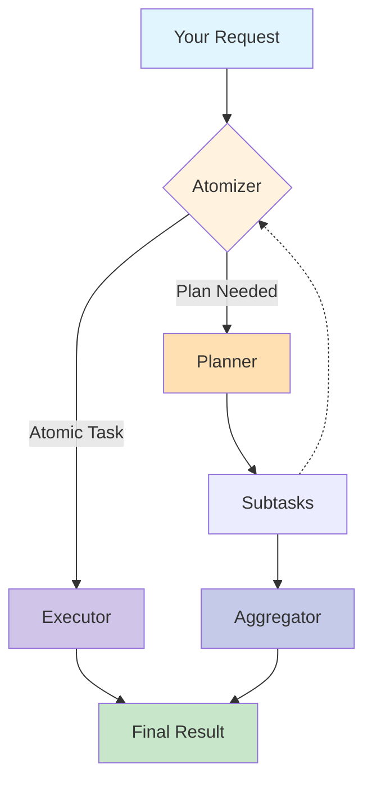
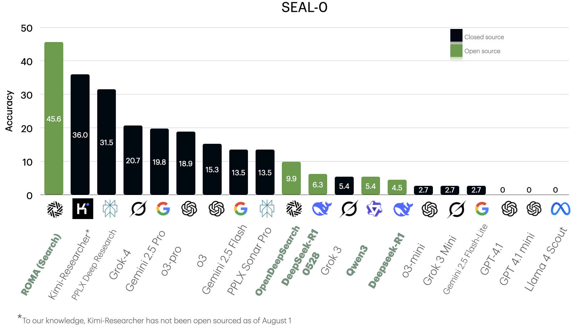
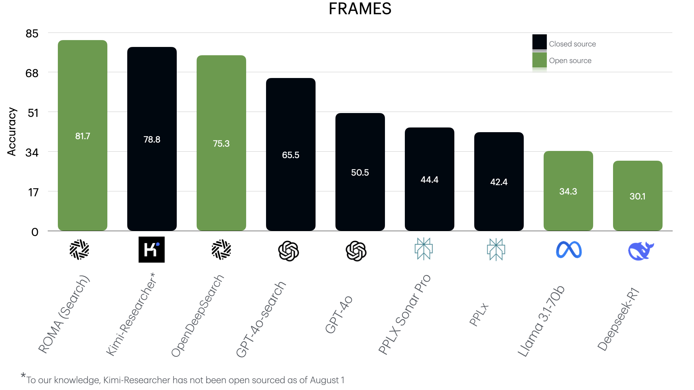
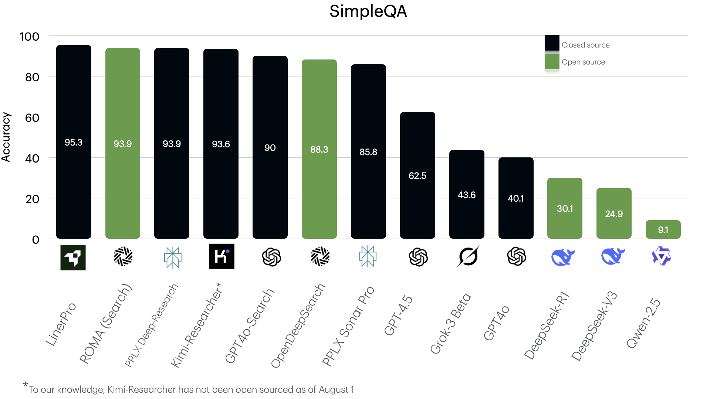

<div align="center">
    
    <h1>ROMA: Recursive Open Meta-Agents</h1>
</div>

<p align="center">
  <strong>Building hierarchical high-performance multi-agent systems made easy! (Beta) </strong>
</p>

<p align="center">
<a href="https://trendshift.io/repositories/14848" target="_blank"></a>
</p>

<p align="center">
  <a href="https://sentient.xyz/" target="_blank" style="margin: 2px;">
    
  </a>
  <a href="https://github.com/sentient-agi" target="_blank" style="margin: 2px;">
    
  </a>
  <a href="https://huggingface.co/Sentientagi" target="_blank" style="margin: 2px;">
    
  </a>
</div>

<div align="center" style="line-height: 1;">
  <a href="https://discord.gg/sentientfoundation" target="_blank" style="margin: 2px;">
    
  </a>
  <a href="https://x.com/SentientAGI" target="_blank" style="margin: 2px;">
    
  </a>
</p>
<p align="center">
  <a href="https://www.sentient.xyz/blog/recursive-open-meta-agent">Technical Blog</a> •
  <a href="docs/">Paper (Coming soon)</a> •
  <a href="https://www.sentient.xyz/">Build Agents for $$$</a>
</p>


</div>

## 📑 Table of Contents
- [🧠 Conceptual Overview](#-conceptual-overview)
- [📦 Installation & Setup](#-installation--setup)
- [⚡ Quickstart: End-to-End Workflow](#-quickstart-end-to-end-workflow)
- [⚙️ Configuration & Storage](#-configuration--storage)
- [🧰 Toolkits](#-toolkits)
- [🌐 REST API & CLI](#-rest-api--cli)
- [🏗️ Core Building Block: `BaseModule`](#-core-building-block-basemodule)
- [📚 Module Reference](#-module-reference)
  - [⚛️ Atomizer](#-atomizer)
  - [📋 Planner](#-planner)
  - [⚙️ Executor](#-executor)
  - [🔀 Aggregator](#-aggregator)
  - [✅ Verifier](#-verifier)
- [🎯 Advanced Patterns](#-advanced-patterns)
- [🧪 Testing](#-testing)
- [💡 Troubleshooting & Tips](#-troubleshooting--tips)
- [📖 Glossary](#-glossary)

---

## 🎯 What is ROMA?

<div align="center">
    
</div>
<br>

**ROMA** is a **meta-agent framework** that uses recursive hierarchical structures to solve complex problems. By breaking down tasks into parallelizable components, ROMA enables agents to tackle sophisticated reasoning challenges while maintaining transparency that makes context-engineering and iteration straightforward. The framework offers **parallel problem solving** where agents work simultaneously on different parts of complex tasks, **transparent development** with a clear structure for easy debugging, and **proven performance** demonstrated through our search agent's strong benchmark results. We've shown the framework's effectiveness, but this is just the beginning. As an **open-source and extensible** platform, ROMA is designed for community-driven development, allowing you to build and customize agents for your specific needs while benefiting from the collective improvements of the community.

## 🏗️ How It Works


**ROMA** framework processes tasks through a recursive **plan–execute loop**:

```python
def solve(task):
    if is_atomic(task):                 # Step 1: Atomizer
        return execute(task)            # Step 2: Executor
    else:
        subtasks = plan(task)           # Step 2: Planner
        results = []
        for subtask in subtasks:
            results.append(solve(subtask))  # Recursive call
        return aggregate(results)       # Step 3: Aggregator

# Entry point:
answer = solve(initial_request)
```
1. **Atomizer** – Decides whether a request is **atomic** (directly executable) or requires **planning**.  
2. **Planner** – If planning is needed, the task is broken into smaller **subtasks**. Each subtask is fed back into the **Atomizer**, making the process recursive.  
3. **Executors** – Handle atomic tasks. Executors can be **LLMs, APIs, or even other agents** — as long as they implement an `agent.execute()` interface.  
4. **Aggregator** – Collects and integrates results from subtasks. Importantly, the Aggregator produces the **answer to the original parent task**, not just raw child outputs.  


#### 📐 Information Flow  
- **Top-down:** Tasks are decomposed into subtasks recursively.  
- **Bottom-up:** Subtask results are aggregated upwards into solutions for parent tasks.  
- **Left-to-right:** If a subtask depends on the output of a previous one, it waits until that subtask completes before execution.  

This structure makes the system flexible, recursive, and dependency-aware — capable of decomposing complex problems into smaller steps while ensuring results are integrated coherently. 

<details>
<summary>Click to view the system flow diagram</summary>



</details><br>

## 🚀 Quick Start

**Recommended: Complete Setup with Docker** (Production-ready, includes all features)

```bash
# One-command setup (builds Docker, starts services, optional E2B/S3)
just setup

# Or with specific profile
just setup crypto_agent

# Verify services are running
curl http://localhost:8000/health

# Solve your first task
just solve "What is the capital of France?"

# Visualize execution with interactive TUI (best with MLflow enabled)
just docker-up-full  # Start with MLflow for full visualization
just viz <execution_id>
```

**What `just setup` includes:**
- ✅ Builds Docker images
- ✅ Starts all services (PostgreSQL, MinIO, REST API)
- ✅ Configures environment (.env)
- ✅ Optional: S3 storage mount (prompts)
- ✅ Optional: E2B code execution template (prompts)
- ✅ Creates CLI shortcuts (`./cli`, `./run`)

**Alternative: Manual Docker Setup** (Skip prompts)

```bash
# Start services without setup wizard
just docker-up           # Basic (PostgreSQL + MinIO + API)
just docker-up-full      # With MLflow observability
```

**Services Available:**
- 🚀 **REST API**: http://localhost:8000/docs
- 🗄️ **PostgreSQL**: Automatic persistence
- 📦 **MinIO**: S3-compatible storage (http://localhost:9001)
- 📊 **MLflow**: http://localhost:5000 (with `docker-up-full`)

See [Quick Start Guide](docs/QUICKSTART.md) and [Deployment Guide](docs/DEPLOYMENT.md) for details.

---

## 🧠 Conceptual Overview
ROMA's module layer wraps canonical DSPy patterns into purpose-built components that reflect the lifecycle of complex task execution:

1. **Atomizer** decides whether a request can be handled directly or needs decomposition.
2. **Planner** breaks non-atomic goals into an ordered graph of subtasks.
3. **Executor** resolves individual subtasks, optionally routing through function/tool calls.
4. **Aggregator** synthesizes subtask outputs back into a coherent answer.
5. **Verifier** (optional) inspects the aggregate output against the original goal before delivering.

Every module shares the same ergonomics: instantiate it with a language model (LM) or provider string, choose a prediction strategy, then call `.forward()` (or `.aforward()` for async) with the task-specific fields.

All modules ultimately delegate to DSPy signatures defined in `roma_dspy.core.signatures`. This keeps interfaces stable even as the internals evolve.

## 📦 Installation & Setup

### Docker Deployment (Recommended)

**Prerequisites:**
- **Docker & Docker Compose** (required)
- **Python 3.12+** (for local development)
- **[Just](https://github.com/casey/just)** command runner (optional, recommended)

**Complete Setup** (Builds Docker, starts services, prompts for E2B/S3):
```bash
# One-command setup
just setup

# Or with specific profile
just setup crypto_agent
```

**Manual Docker Start** (Skip setup wizard):
```bash
just docker-up       # Basic services (PostgreSQL + MinIO + API)
just docker-up-full  # With MLflow observability
```

**Required Environment Variables** (auto-configured by `just setup`):
```bash
# LLM Provider (at least one required)
OPENROUTER_API_KEY=...     # Recommended (single key for all models)
# OR
OPENAI_API_KEY=...
ANTHROPIC_API_KEY=...
GOOGLE_API_KEY=...

# Optional: Toolkit API keys
E2B_API_KEY=...           # Code execution (prompted during setup)
EXA_API_KEY=...           # Web search via MCP
COINGECKO_API_KEY=...     # CoinGecko Pro API (crypto_agent profile)
```

Docker Compose automatically handles PostgreSQL, MinIO, and service configuration.

### Local Python Development (Optional)

For development/testing without Docker:

```bash
# Base installation (modules only, no API server)
pip install -e .

# With REST API support (FastAPI + Uvicorn)
pip install -e ".[api]"
```

**Note:** E2B code execution is included in base dependencies. For local API usage, you'll need to configure PostgreSQL manually (Docker handles this automatically).

> **Recommendation**: Use Docker deployment for production features (persistence, API, observability). Local installation is suitable for module development and testing only.

## ⚡ Quickstart: End-to-End Workflow
The following example mirrors a typical orchestration loop. It uses three different providers to showcase how easily each module can work with distinct models and strategies.

```python
import dspy
from roma_dspy import Aggregator, Atomizer, Executor, Planner, Verifier, SubTask
from roma_dspy.types import TaskType

# Optional tool that the Executor may call
def get_weather(city: str) -> str:
    """Return a canned weather report for the city."""
    return f"The weather in {city} is sunny."

# Executor geared toward ReAct with a Fireworks model
executor_lm = dspy.LM(
    "fireworks_ai/accounts/fireworks/models/kimi-k2-instruct-0905",
    temperature=0.7,
    cache=True,
)
executor = Executor(
    lm=executor_lm,
    prediction_strategy="react",
    tools=[get_weather],
    context_defaults={"track_usage": True},
)

# Atomizer decides when to branch into planning
atomizer = Atomizer(
    lm=dspy.LM("openrouter/google/gemini-2.5-flash", temperature=0.6, cache=False),
    prediction_strategy="cot",
    context_defaults={"track_usage": True},
)

# Planner produces executable subtasks for non-atomic goals
planner = Planner(
    lm=dspy.LM("openrouter/openai/gpt-4o-mini", temperature=0.85, cache=True),
    prediction_strategy="cot",
    context_defaults={"track_usage": True},
)

aggregator = Aggregator(
    lm=dspy.LM("openrouter/openai/gpt-4o-mini", temperature=0.65),
    prediction_strategy="cot",
)

verifier = Verifier(
    lm=dspy.LM("openrouter/openai/gpt-4o-mini", temperature=0.0),
)

def run_pipeline(goal: str) -> str:
    atomized = atomizer.forward(goal)
    if atomized.is_atomic or atomized.node_type.is_execute:
        execution = executor.forward(goal)
        candidate = execution.output
    else:
        plan = planner.forward(goal)
        results = []
        for idx, subtask in enumerate(plan.subtasks, start=1):
            execution = executor.forward(subtask.goal)
            results.append(
                SubTask(
                    goal=subtask.goal,
                    task_type=subtask.task_type,
                    dependencies=subtask.dependencies,
                )
            )
        aggregated = aggregator.forward(goal, results)
        candidate = aggregated.synthesized_result

    verdict = verifier.forward(goal, candidate)
    if verdict.verdict:
        return candidate
    return f"Verifier flagged the output: {verdict.feedback or 'no feedback returned'}"

print(run_pipeline("Plan a weekend in Barcelona and include a packing list."))
```

Highlights:
- Different modules can run on different LMs and temperatures.
- Tools are provided either at construction or per-call.
- `context_defaults` ensures each `.forward()` call enters a proper `dspy.context()` with the module's LM.

---

## ⚙️ Configuration & Storage

ROMA-DSPy uses **OmegaConf** for layered configuration with **Pydantic** validation, and provides **execution-scoped storage** for complete task isolation.

### Quick Configuration Example

```python
from roma_dspy.config import load_config

# Load with profile and overrides
config = load_config(
    profile="crypto_agent",
    overrides=["agents.executor.llm.temperature=0.3"]
)
```

**Available Profiles**: `general`, `crypto_agent` (list with `just list-profiles`)

**See**: [Configuration Guide](docs/CONFIGURATION.md) for complete documentation on profiles, agent configuration, LLM settings, toolkit configuration, and task-aware agent mapping.

### Storage

Storage is automatic and execution-scoped - each task gets an isolated directory. Large toolkit responses (>100KB) are automatically stored as Parquet files.

```python
from roma_dspy.core.engine.solve import solve

# Storage created automatically at: {base_path}/executions/{execution_id}/
result = solve("Analyze blockchain transactions")
```

**Features**: Execution isolation, S3-compatible, automatic Parquet storage, Docker-managed

**See**: [Deployment Guide](docs/DEPLOYMENT.md) for production storage configuration including S3 integration.

---

## 🧰 Toolkits

ROMA-DSPy includes 9 built-in toolkits that extend agent capabilities:

**Core**: FileToolkit, CalculatorToolkit, E2BToolkit (code execution)
**Crypto**: CoinGeckoToolkit, BinanceToolkit, DefiLlamaToolkit, ArkhamToolkit
**Search**: SerperToolkit (web search)
**Universal**: MCPToolkit (connect to any [MCP server](https://github.com/wong2/awesome-mcp-servers))

### Quick Configuration

```yaml
agents:
  executor:
    toolkits:
      - class_name: "FileToolkit"
        enabled: true
      - class_name: "E2BToolkit"
        enabled: true
        toolkit_config:
          timeout: 600
```

**See**: [Toolkits Reference](docs/TOOLKITS.md) for complete toolkit documentation including all tools, configuration options, MCP integration, and custom toolkit development.

---

## 🌐 REST API & CLI

ROMA-DSPy provides both a REST API and CLI for production use.

### REST API

FastAPI server with interactive documentation:

```bash
# Starts automatically with Docker
just docker-up

# API Documentation: http://localhost:8000/docs
# Health check: http://localhost:8000/health
```

**Endpoints**: Execution management, checkpoints, visualization, metrics

### CLI

```bash
# Local task execution
roma-dspy solve "Your task" --profile general

# Server management
roma-dspy server start
roma-dspy server health

# Execution management
roma-dspy exec create "Task"
roma-dspy exec status <id> --watch

# Interactive TUI visualization (requires MLflow for best results)
just viz <execution_id>

# Full help
roma-dspy --help
```

**See**: API documentation at `/docs` endpoint for complete OpenAPI specification and interactive testing.

---

## 🏗️ Core Building Block: `BaseModule`
All modules inherit from `BaseModule`, located at `roma_dspy/core/modules/base_module.py`. It standardizes:
- signature binding via DSPy prediction strategies,
- LM instantiation and context management,
- tool normalization and merging,
- sync/async entrypoints with safe keyword filtering.

### Context & LM Management
When you instantiate a module, you can either provide an existing `dspy.LM` or let the module build one from a provider string (`model`) and optional keyword arguments (`model_config`).

```python
from roma_dspy import Executor

executor = Executor(
    model="openrouter/openai/gpt-4o-mini",
    model_config={"temperature": 0.5, "cache": True},
)
```

Internally, `BaseModule` ensures that every `.forward()` call wraps the predictor invocation in:

```python
with dspy.context(lm=self._lm, **context_defaults):
    ...
```

You can inspect the effective LM configuration via `get_model_config()` to confirm provider, cache settings, or sanitized kwargs.

### Working with Tools
Tools can be supplied as a list, tuple, or mapping of callables accepted by DSPy’s ReAct/CodeAct strategies.

```python
executor = Executor(tools=[get_weather])
executor.forward("What is the weather in Amman?", tools=[another_function])
```

`BaseModule` automatically deduplicates tools based on object identity and merges constructor defaults with per-call overrides.

### Prediction Strategies
ROMA exposes DSPy's strategies through the `PredictionStrategy` enum (`roma_dspy/types/prediction_strategy.py`). Use either the enum or a case-insensitive string alias:

```python
from roma_dspy.types import PredictionStrategy

planner = Planner(prediction_strategy=PredictionStrategy.CHAIN_OF_THOUGHT)
executor = Executor(prediction_strategy="react")
```

Available options include `Predict`, `ChainOfThought`, `ReAct`, `CodeAct`, `BestOfN`, `Refine`, `Parallel`, `majority`, and more. Strategies that require tools (`ReAct`, `CodeAct`) automatically receive any tools you pass to the module.

### Async Execution
Every module offers an `aforward()` method. When the underlying DSPy predictor supports async (`acall`/`aforward`), ROMA dispatches asynchronously; otherwise, it gracefully falls back to the sync implementation while preserving awaitability.

```python
result = await executor.aforward("Download the latest sales report")
```

## 📚 Module Reference

### ⚛️ Atomizer
**Location**: `roma_dspy/core/modules/atomizer.py`

**Purpose**: Decide whether a goal is atomic or needs planning.

**Constructor**:
```python
Atomizer(
    prediction_strategy: Union[PredictionStrategy, str] = "ChainOfThought",
    *,
    lm: Optional[dspy.LM] = None,
    model: Optional[str] = None,
    model_config: Optional[Mapping[str, Any]] = None,
    tools: Optional[Sequence|Mapping] = None,
    **strategy_kwargs,
)
```

**Inputs** (`AtomizerSignature`):
- `goal: str`

**Outputs** (`AtomizerResponse`):
- `is_atomic: bool` — whether the task can run directly.
- `node_type: NodeType` — `PLAN` or `EXECUTE` hint for downstream routing.

**Usage**:
```python
atomized = atomizer.forward("Curate a 5-day Tokyo itinerary with restaurant reservations")
if atomized.is_atomic:
    ...  # send directly to Executor
else:
    ...  # hand off to Planner
```

The Atomizer is strategy-agnostic but typically uses `ChainOfThought` or `Predict`. You can pass hints (e.g., `max_tokens`) via `call_params`:

```python
atomizer.forward(
    "Summarize this PDF",
    call_params={"max_tokens": 200},
)
```

### 📋 Planner
**Location**: `roma_dspy/core/modules/planner.py`

**Purpose**: Break a goal into ordered subtasks with optional dependency graph.

**Constructor**: identical pattern as the Atomizer.

**Inputs** (`PlannerSignature`):
- `goal: str`

**Outputs** (`PlannerResult`):
- `subtasks: List[SubTask]` — each has `goal`, `task_type`, and `dependencies`.
- `dependencies_graph: Optional[Dict[str, List[str]]]` — explicit adjacency mapping when returned by the LM.

**Usage**:
```python
plan = planner.forward("Launch a B2B webinar in 6 weeks")
for subtask in plan.subtasks:
    print(subtask.goal, subtask.task_type)
```

`SubTask.task_type` is a `TaskType` enum that follows the ROMA MECE framework (Retrieve, Write, Think, Code Interpret, Image Generation).

### ⚙️ Executor
**Location**: `roma_dspy/core/modules/executor.py`

**Purpose**: Resolve atomic goals, optionally calling tools/functions through DSPy's ReAct, CodeAct, or similar strategies.

**Constructor**: same pattern; the most common strategies are `ReAct`, `CodeAct`, or `ChainOfThought`.

**Inputs** (`ExecutorSignature`):
- `goal: str`

**Outputs** (`ExecutorResult`):
- `output: str | Any`
- `sources: Optional[List[str]]` — provenance or citations.

**Usage**:
```python
execution = executor.forward(
    "Compile a packing list for a 3-day ski trip",
    config={"temperature": 0.4},  # per-call LM override
)
print(execution.output)
```

To expose tools only for certain calls:

```python
execution = executor.forward(
    "What is the weather in Paris?",
    tools=[get_weather],
)
```

### 🔀 Aggregator
**Location**: `roma_dspy/core/modules/aggregator.py`

**Purpose**: Combine multiple subtask results into a final narrative or decision.

**Constructor**: identical pattern.

**Inputs** (`AggregatorResult` signature):
- `original_goal: str`
- `subtasks_results: List[SubTask]` — usually the planner’s proposals augmented with execution outputs.

**Outputs** (`AggregatorResult` base model):
- `synthesized_result: str`

**Usage**:
```python
aggregated = aggregator.forward(
    original_goal="Plan a data migration",
    subtasks_results=[
        SubTask(goal="Inventory current databases", task_type=TaskType.RETRIEVE),
        SubTask(goal="Draft migration timeline", task_type=TaskType.WRITE),
    ],
)
print(aggregated.synthesized_result)
```

Because it inherits `BaseModule`, you can still attach tools (e.g., a knowledge-base retrieval function) if your aggregation strategy requires external calls.

### ✅ Verifier
**Location**: `roma_dspy/core/modules/verifier.py`

**Purpose**: Validate that the synthesized output satisfies the original goal.

**Inputs** (`VerifierSignature`):
- `goal: str`
- `candidate_output: str`

**Outputs**:
- `verdict: bool`
- `feedback: Optional[str]`

**Usage**:
```python
verdict = verifier.forward(
    goal="Draft a GDPR-compliant privacy policy",
    candidate_output=aggregated.synthesized_result,
)
if not verdict.verdict:
    print("Needs revision:", verdict.feedback)
```

## 🎯 Advanced Patterns

### Swapping Models at Runtime
Use `replace_lm()` to reuse the same module with a different LM (useful for A/B testing or fallbacks).

```python
fast_executor = executor.replace_lm(dspy.LM("openrouter/anthropic/claude-3-haiku"))
```

### Per-Call Overrides
You can alter LM behavior or provide extra parameters without rebuilding the module.

```python
executor.forward(
    "Summarize the meeting notes",
    config={"temperature": 0.1, "max_tokens": 300},
    context={"stop": ["Observation:"]},
)
```

`call_params` (or keyword arguments) are filtered to match the DSPy predictor’s accepted kwargs, preventing accidental errors.

### Tool-Only Execution
If you want deterministic tool routing, you can set a dummy LM (or a very low-temperature model) and pass pure Python callables.

```python
from roma_dspy import Executor

executor = Executor(
    prediction_strategy="code_act",
    lm=dspy.LM("openrouter/openai/gpt-4o-mini", temperature=0.0),
    tools={"get_weather": get_weather, "lookup_user": lookup_user},
)
```

ROMA will ensure both constructor and per-call tools are available to the strategy.

## 🧪 Testing

```bash
# Run all tests
just test

# Run specific tests
pytest tests/unit/ -v
pytest tests/integration/ -v
```

**See**: `justfile` for all available test commands.

## 💡 Troubleshooting & Tips
- **`ValueError: Either provide an existing lm`** — supply `lm=` or `model=` when constructing the module.
- **`Invalid prediction strategy`** — check spelling; strings are case-insensitive but must match a known alias.
- **Caching** — pass `cache=True` on your LM or set it in `model_config` to reutilize previous completions.
- **Async contexts** — when mixing sync and async calls, ensure your event loop is running (e.g., use `asyncio.run`).
- **Tool duplicates** — tools are deduplicated by identity; create distinct functions if you need variations.

## 📖 Glossary

### Core Concepts
- **DSPy**: Stanford's declarative framework for prompting, planning, and tool integration.
- **Prediction Strategy**: The DSPy class/function that powers reasoning (CoT, ReAct, etc.).
- **SubTask**: Pydantic model describing a decomposed unit of work (`goal`, `task_type`, `dependencies`).
- **NodeType**: Whether the Atomizer chose to `PLAN` or `EXECUTE`.
- **TaskType**: MECE classification for subtasks (`RETRIEVE`, `WRITE`, `THINK`, `CODE_INTERPRET`, `IMAGE_GENERATION`).
- **Context Defaults**: Keyword arguments provided to `dspy.context(...)` on every call.

### Configuration & Storage
- **FileStorage**: Execution-scoped storage manager providing isolated directories per task execution.
- **DataStorage**: Automatic Parquet storage system for large toolkit responses (threshold-based).
- **Execution ID**: Unique identifier for each task execution, used for storage isolation.
- **Base Path**: Root directory for all storage operations (local path or S3 bucket).
- **Profile**: Named configuration preset (e.g., `general`, `crypto_agent`).
- **Configuration Override**: Runtime value that supersedes profile/default settings.

### Toolkits
- **BaseToolkit**: Abstract base class for all toolkits providing storage integration and tool registration.
- **REQUIRES_FILE_STORAGE**: Metadata flag indicating a toolkit requires FileStorage (e.g., FileToolkit).
- **Toolkit Config**: Toolkit-specific settings like API keys, timeouts, and thresholds.
- **Tool Selection**: Include/exclude lists to filter which tools from a toolkit are available.
- **Storage Threshold**: Size limit (KB) above which responses are stored in Parquet format.

### Architecture
- **Execution-Scoped Isolation**: Pattern where each execution gets unique storage directory.
- **Parquet Integration**: Automatic columnar storage for large structured data.
- **S3 Compatibility**: Ability to use S3-compatible storage via Docker volume mounts.
- **Tool Registration**: Automatic discovery and registration of toolkit methods as callable tools.

---

Happy building! If you extend or customize a module, keep the signatures aligned so your higher-level orchestration remains stable.

**Additional Resources:**
- [Quick Start Guide](docs/QUICKSTART.md) - Get started in under 10 minutes
- [Configuration Guide](docs/CONFIGURATION.md) - Complete configuration reference
- [Toolkits Reference](docs/TOOLKITS.md) - All built-in and custom toolkits
- [Deployment Guide](docs/DEPLOYMENT.md) - Production deployment with Docker
- [E2B Setup](docs/E2B_SETUP.md) - Code execution toolkit setup
- [Observability](docs/OBSERVABILITY.md) - MLflow tracking and monitoring
- [Configuration System](config/README.md) - Configuration profiles and examples


## 📊 Benchmarks

We evaluate our simple implementation of a search system using ROMA, called ROMA-Search across three benchmarks: **SEAL-0**, **FRAMES**, and **SimpleQA**.  
Below are the performance graphs for each benchmark.

### [SEAL-0](https://huggingface.co/datasets/vtllms/sealqa)
SealQA is a new challenging benchmark for evaluating Search-Augmented Language models on fact-seeking questions where web search yields conflicting, noisy, or unhelpful results.  



---

### [FRAMES](https://huggingface.co/datasets/google/frames-benchmark)
<details>
<summary>View full results</summary>

A comprehensive evaluation dataset designed to test the capabilities of Retrieval-Augmented Generation (RAG) systems across factuality, retrieval accuracy, and reasoning.  



</details>

---

### [SimpleQA](https://openai.com/index/introducing-simpleqa/)
<details>
<summary>View full results</summary>

Factuality benchmark that measures the ability for language models to answer short, fact-seeking questions.  



</details>

## 🧩 Foundations & Lineage

While ROMA introduces a practical, open-source framework for hierarchical task execution, it is directly built upon two foundational research contributions introduced in [WriteHERE](https://arxiv.org/abs/2503.08275):

- **Heterogeneous Recursive Planning** — The overall architecture of ROMA follows the framework first introduced in prior work on *heterogeneous recursive planning*, where complex tasks are recursively decomposed into a graph of subtasks, each assigned a distinct cognitive type.  

- **Type Specification in Decomposition** — ROMA’s “Three Universal Operations” (THINK 🤔, WRITE ✍️, SEARCH 🔍) generalize the *type specification in decomposition* hypothesis, which identified reasoning, composition, and retrieval as the three fundamental cognitive types.  

These contributions are described in detail in the WriteHERE repository and paper. By explicitly adopting and extending this foundation, ROMA provides a **generalizable scaffold, agent system, versatility, and extensibility** that builds upon these insights and makes them usable for builders across domains. 

## 🙏 Acknowledgments

This framework would not have been possible if it wasn't for these amazing open-source contributions!
- Inspired by the hierarchical planning approach described in ["Beyond Outlining: Heterogeneous Recursive Planning"](https://arxiv.org/abs/2503.08275) by Xiong et al.
- [Pydantic](https://github.com/pydantic/pydantic) - Data validation using Python type annotations
- [DSPy]([https://dspy.ai/)) - Framework for programming AI agents
- [E2B](https://github.com/e2b-dev/e2b) - Cloud runtime for AI agents

## 📚 Citation

If you use the ROMA repo in your research, please cite:

```bibtex
@software{al_zubi_2025_17052592,
  author       = {Al-Zubi, Salah and
                  Nama, Baran and
                  Kaz, Arda and
                  Oh, Sewoong},
  title        = {SentientResearchAgent: A Hierarchical AI Agent
                   Framework for Research and Analysis
                  },
  month        = sep,
  year         = 2025,
  publisher    = {Zenodo},
  version      = {ROMA},
  doi          = {10.5281/zenodo.17052592},
  url          = {https://doi.org/10.5281/zenodo.17052592},
  swhid        = {swh:1:dir:69cd1552103e0333dd0c39fc4f53cb03196017ce
                   ;origin=https://doi.org/10.5281/zenodo.17052591;vi
                   sit=swh:1:snp:f50bf99634f9876adb80c027361aec9dff97
                   3433;anchor=swh:1:rel:afa7caa843ce1279f5b4b29b5d3d
                   5e3fe85edc95;path=salzubi401-ROMA-b31c382
                  },
}
```

## 🌟 Star History

<div align="center">

[](https://www.star-history.com/#sentient-agi/roma&Date)

</div>

## 📄 License

This project is licensed under the Apache 2.0 License - see the [LICENSE](LICENSE) file for details.
